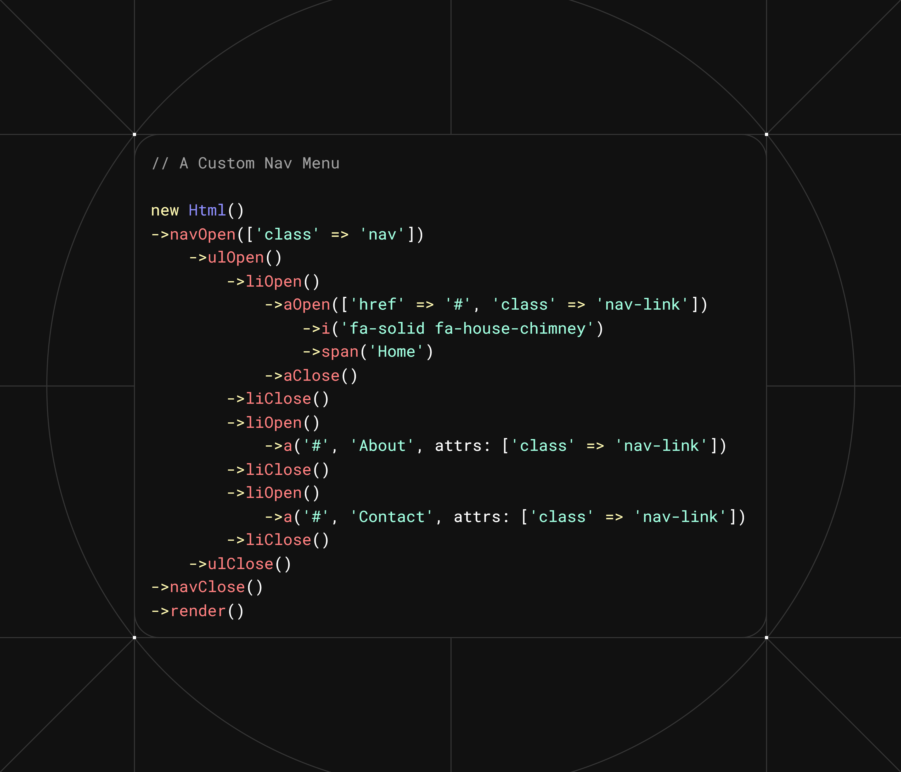
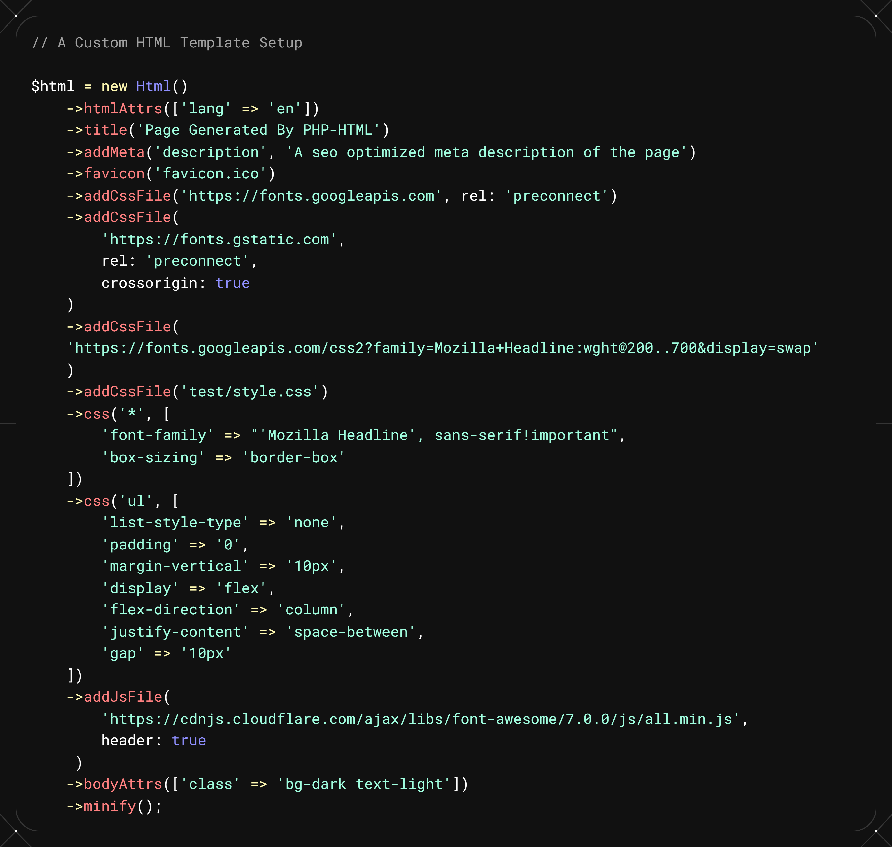
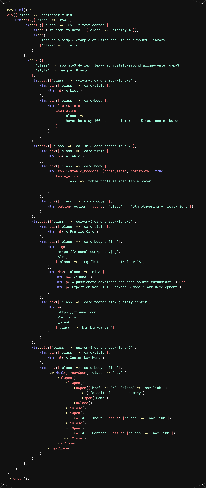

## 🈚 Want to customize your  HTML output from 🐘 PHP?
- Don't need continuous `?>`  and `<?php` anymore.
- Use a more intuitive syntax for HTML generation.
- Create 🌀 `reusable components` 🌀 easily with PHP.
- Enjoy better code organization and readability.
- Use `Flutter-like` widget structure for your HTML.
- Use `Zisunal\PhpHtml` to create your HTML output with ease.
- Use with `Vanilla PHP` or any `PHP framework` freely.

### 📑 See Some Examples
<div style="display:flex;justify-content:space-between;gap:10px;">
    <div style="flex:1;">
        <h3>Custom Navigation Menu</h3>
        <hr>
            
    </div>
    <div style="flex:1;">
        <h3>Custom Template</h3>
        <hr>
        
    </div>
</div>

- A Custom HTML with Organized Widget Tree like Flutter
  ---
    

### 1. Let's Start with Installing `Zisunal\PhpHtml`
```bash
composer require zisunal/php-html
```

### 2. If you are not using frameworks like `Laravel` / `Symfony` / `CodeIgniter`, you need to include the autoloader in your project root:
```php
require_once 'vendor/autoload.php';
```

### 3. Use `Zisunal\PhpHtml\Html` to Start:
```php
use Zisunal\PhpHtml\Html;
```

### 4. For Static Html Methods, use `Zisunal\PhpHtml\Htm` instead:
```php
use Zisunal\PhpHtml\Htm;
```
***Note:***
- This first one is `Html` and the second one is `Htm`. 
- No ending `l` in the second one.
- `Htm` can be used to create static HTML elements without the need for an instance.
    ```php
    Htm::div(['class' => 'container'],
        Htm::h1('Hello World')
        ->hr(),
        Htm::p('This is a static paragraph.')
    );
    ```
- Most of the methods of `Html` are also available in `Htm`, so you can use them interchangeably.
- You can create an instance of `Html` like this:
    ```php
    $html = new Html();
    ```
- If you add any of the templating methods with a `Html`, it will render a complete HTML document.
    ```php
    // This code will generate a whole Html document starting from <!DOCTYPE html> to the ending </html>
    $html->title('My Page');
    ```
- If you only add the tags' methods for the body, it will only render the content as a component.
    ```php
    // This code will generate a div element with a class of "container" without the full Html document
    $html->divOpen(['class' => 'container'])
            ->h1Open()
                ->innerText('Hello World')
            ->h1Close()
            ->hr
            ->pOpen()
                ->innerText('This is a static paragraph.')
            ->pClose();
        ->divClose()
    ->render();
    // Notice that we can open and close almost all the container tags anywhere and add any content inside them.
    ```
- If you want `single div` instead of `divOpen` and `divClose` in the previous code,
    ```php
    $html->div(['class' => 'container'],
        $html->h1Open()
            ->innerText('Hello World')
        ->h1Close()
        ->hr
        ->pOpen()
            ->innerText('This is a static paragraph.')
        ->pClose();
    )->render();
    // Notice that, we are passing the attributes of <div> in the 1st argument and any number of Html/Htm in the 2nd, 3rd, ..... arguments
    ```
- If you want the `shorter version` of the previous code,
    ```php
    $html->div(['class' => 'container'],
        $html->h1('Hello World')->hr->p('This is a static paragraph.')
    )->render();
    // You can use shorter syntax for the most useful container tags and to all the self-closing tags
    ```
- If you want the previous code with `only static methods`,
    ```php
    Htm::div(['class' => 'container'],
        Htm::h1('Hello World'),
        Htm::hr(),
        Htm::p('This is a static paragraph.')
    )->render();
    ```
### 5. The Most Important info to know:
---
- You can call `render()` method at the end of any `Html` or `Htm` chain to ***get/print*** the final output. Remember, once you called `render()`, you can't add any more elements to the chain.
- You can pass `true` as an argument to `render()` method to get the output as a string instead of printing it directly.
- You can minify the whole Html, CSS, JS output by calling `minify()` method anywhere before `render()`.
    ```php
    $html->title('My Title')
        ->p('My Paragraph')
        ->minify()
        ->render();
    // If you view the page source, you will see the minified output.
    ```
- The following static and non-static methods are equivalent (assuming `$html = new Html()`). So, you can use any of them interchangeably:
  ---
  - `$html->hr` => `$html->hr()` => `Html::hr()` => `Htm::hr()`
  - `$html->br` => `$html->br()` => `Html::br()` => `Htm::br()`
  - `$html->wbr` => `$html->wbr()` => `Html::wbr()` => `Htm::wbr()`
---
- We will say📝 `Single Tags` to refer to `self-closing tags` like `<br />`, `<hr />`, `<wbr />` from now on.
- We will say📝 `Double Tags` to refer to `opening and closing tags` like `<div>`, `<h1>`, `<p>`, `<span>` from now on.
---
- All the `Double Tags` have 2 methods: `tagnameOpen()` and `tagnameClose()`.
  - `divOpen()` and `divClose()` for `<div>` tags.
  - `h1Open()` and `h1Close()` for `<h1>` tags.
  - `pOpen()` and `pClose()` for `<p>` tags.
  - `spanOpen()` and `spanClose()` for `<span>` tags.
  - `aOpen()` and `aClose()` for `<a>` tags.
  - And so on for all other double tags.
  - Any other `Html tag` or an `innerText()` method can be called inside `Double Tag` to customize the content as needed.
    ```php
    $html->divOpen(['class' => 'container'])
        ->h1Open()
            ->innerText('Hello World')
        ->h1Close()
        ->hr()
        ->pOpen()
            ->innerText('This is a static paragraph.')
        ->pClose()
    ->divClose();
    ```
- All the `Single Tags` can be called directly without any Open and Close methods. It will accept attributes as an array.
  - ```php
    $html->input([
        'class' => 'img-fluid',
        'name' => 'fullName',
        'id' => 'fullName',
        'placeholder' => 'Enter your full name',
        'required' => true
    ]);
    ```
- Some `Single Tags` can also accept their required contents as arguments before the attributes array.
  - ```php
    $html->img('image.jpg', 'Alt Text', ['class' => 'img-fluid']);
    ```
- Some `Double Tags` can also accept their contents as arguments before the attributes array.
    ```php
    $html->h1('Hello World', ['class' => 'title']);
    // Same as:
    $html->h1Open(['class' => 'title'])
        ->innerText('Hello World')
    ->h1Close();
    ```
---
## 📖 Methods Available to use:
- You can find the complete list of ***methods*** and ***documentations*** for [`Html` here](./docs/html.md)
- You can find the complete list of ***methods*** and ***documentations*** for [`Htm` here](./docs/htm.md)
---
## ❓ FAQ
### Q: What is the difference between `Html` and `Htm`?
A: `Html` is the main class for generating HTML content, while `Htm` is a lightweight version that focuses on generating HTML snippets without the full document structure.
### Q: Can I use `Htm` methods inside `Html`?
A: Yes, you can use `Htm` methods inside any `Html` methods as needed.

## 🔧 Adding more tags support
If you need any other standard Html tag support you can email me by [clicking here](mailto:alzisun1111@gmail.com?subject=Add%20More%20Tags%20Support%20in%20PhpHtml)

## 📝 Contributing

We welcome contributions to the `Zisunal\PhpHtml` package! If you'd like to contribute, please follow these steps:

1. **Fork the repository**: Create your own copy of the repository by forking it on GitHub.

2. **Create a new branch**: Before making changes, create a new branch for your feature or bug fix:
   ```
   git checkout -b my-feature-branch
   ```

3. **Make your changes**: Implement your feature or fix the bug in your local copy of the repository.

4. **Write tests**: If applicable, write tests to cover your changes. Ensure that all tests pass before submitting your pull request.

5. **Submit a pull request**: Once you're satisfied with your changes, push your branch to your forked repository and submit a pull request to the main repository.

6. **Follow the code style**: Please adhere to the existing code style and conventions used in the project.

Thank you for your contributions!